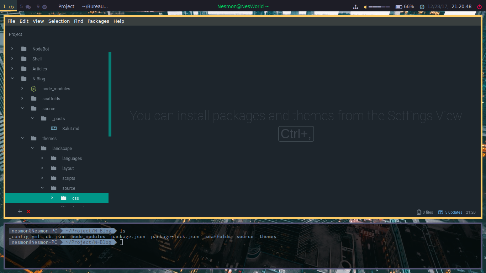

# dotfiles-collection

Bienvenue dans la collection de dotfiles. Ce dépôt rassemble plusieurs configurations et setups historiques.

## Contenu et présentation visuelle

- **LilyBook-Surface** — configuration en cours de test pour un Surface Pro 3
  - [Accéder au dossier](./LilyBook-Surface)
  

- **OldDotfiles** — ancien dotfiles i3 / polybar / urxvt
  - [Accéder au dossier](./OldDotfiles)

## Utilisation

Chaque dossier contient son propre README et des scripts d’installation ou de déploiement. Ouvrez le dossier correspondant pour lire les instructions spécifiques.

> Note : les configurations de ce dépôt sont expérimentales et peuvent ne pas fonctionner correctement sur tous les environnements.
