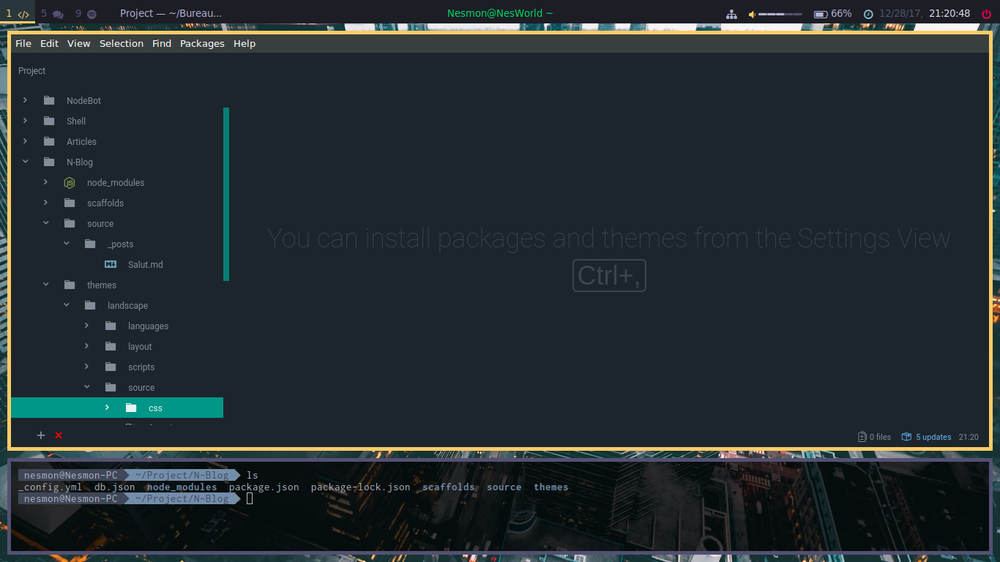

# Dotfiles
Ce repo vas surtout me servir en cas de problème sur mon pc.
Vous pouvez comme même l'utiliser si besoin.





## Mon OS : 

J'utilise xubuntu 17.04.

## Interface graphique :

Mon interface graphique est i3wm coupler a i3-gaps pour avoir un espacement entre mais fenêtre quand il y en a plusieurs.

Tout d'abord installer i3 :
```
sudo apt-get install i3
```
Ensuite, relancez votre session et laisser comme touche votre touche Windows comme touche mod.


Ensuite, on installe i3-gaps:
Puis pour l''installer render-vous sur leur [repo](https://github.com/Airblader/i3).

Et faites les manipulations suivantes : 
*P.S. : Je les pris directement de leur repo.*
```sh
cd /path/where/you/want/the/repository

# clone the repository
git clone https://www.github.com/Airblader/i3 i3-gaps
cd i3-gaps

# compile & install
autoreconf --force --install
rm -rf build/
mkdir -p build && cd build/

# Disabling sanitizers is important for release versions!
# The prefix and sysconfdir are, obviously, dependent on the distribution.
../configure --prefix=/usr --sysconfdir=/etc --disable-sanitizers
make
sudo make install
```

Il ne reste plus que a rajouter dans votre fichier de config :
~ ./.config/i3/config 
```
for_window [class="^.*"] border pixel 5
for_window [class=".*"] title-format "   %title"
gaps inner 10
smart_border on
smart_gaps on
```

## Mes logiciel :

- Gestionnaire de fichiers : Thunar
- Gestionnaire de thèmes : lxappearance
- Pour dev : VSCode / Atom / Intelij
- Navigateur : Vivaldi
- Discord 
- Terminal : urxvt-unicode
- Diviseur de terminal : Tmux
- Thème de terminal : zsh + oh-my-zsh
- Musique : Spotify
- Video : VLC ou leteur de base
- Lanceur d'app : rofi
- Theme : Obsidian-2-green
- Icon : masalla

## Config compléte :
### Prérequis
Pour avoir aucun problème avec la config suivante installer les packages suivant :

Polybar : 
```
sudo apt-get install cairo libxcb python2 xcb-proto xcb-util-image xcb-util-wm xcb-util-xrm xcb-util-cursor alsa-lib jsoncpp libmpdclient libcurl wireless_tools 
git clone --branch 3.1.0 --recursive https://github.com/jaagr/polybar
mkdir polybar/build
cd polybar/build
cmake ..
sudo make install
```

urxvt-unicode :
``` 
sudo apt-get install rxvt-unicode
```

Rofi : 
[Regarder via se lien.](https://github.com/DaveDavenport/rofi/blob/next/INSTALL.md)

### Fichiers de configuration :

Copier le contenu du  fichier `config` dans le fichier `.config` qui se trouve a la racine de votre dossier utilisateur.

Installer le thème obsidian-2-green et le pack d'icon masalla : 

```bash
# Obsidian theme
sudo add-apt-repository ppa:noobslab/themes
sudo apt-get update
sudo apt-get install obsidian-gtk-theme

# Masalla icon
sudo add-apt-repository ppa:noobslab/icons
sudo apt-get update
sudo apt-get install masalla-icon-theme
```
